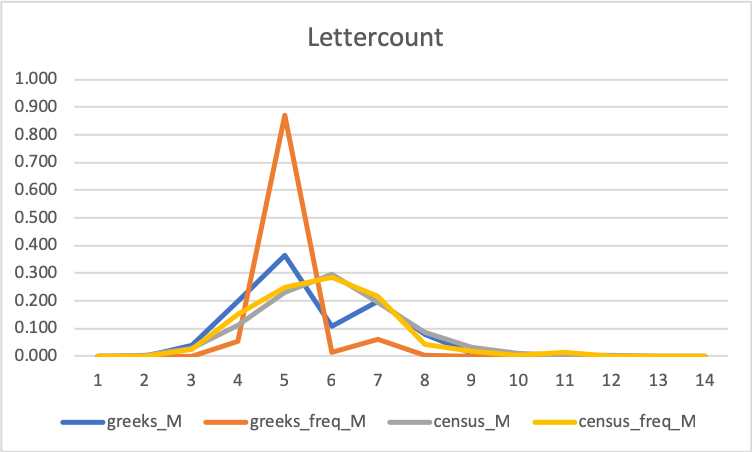
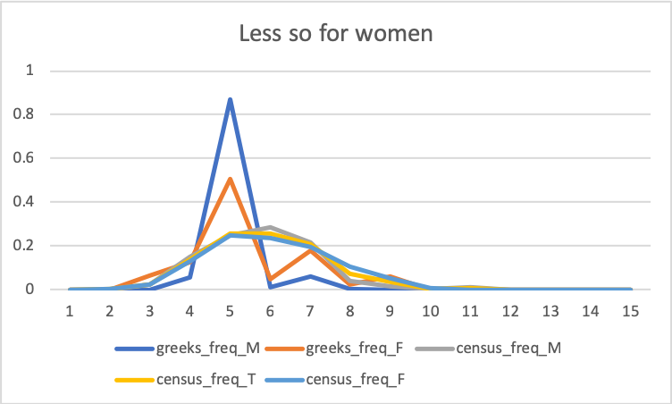

# Heroic_names
Analysis of Greek hero names in the US census data.

## Hipsters and Greek heroes
How many people are called Antigone?         
I am reading Stephen Fry's Heroes, which is a lovely book. I am getting barraged by names, lots of names, some "amazing".      
This led me to wonder what the frequency of these names is.

## Data
Consequenly I used the [US census data](https://www.ssa.gov/oact/babynames/limits.html) to find out the frequency of names.        
I use the US census data, because it is a big country, but because they are wierd and call their kids things like Satan.

For the names of Greek heroes, I copy-pasted several Category pages from Wikipedia.
This is not perfect and required several iterations —say, "Where is Heracles?" or "Where is Hippolyta?".
It has several contaminants, but they are generally manageable.       

A nasty downside is that by using general categories ("Greek mythology") I don't have a nice way to split names into greek heroes, gods, titans and so forth.

One major issue is that there are many name variants, especially given that I am searching Ancient Greek names that are translitterated to Latin or English with different schema.
A case in point is "Hercules", which is the Latin variant of the name "Heracles". But in French it's "Hercule" and in Modern Greek it's "Iraklis".

Also, some weirder cases might or might not appear. Let's take the name 'Ariana', literally, a female Aryan person (_sensu_ ancient Indian/Persian nomands, not German blonds).
As this is a name of a member of a group of people and no hero had an adventure with Aryans &mdash;not even the argonauts&mdash; the word is not in the categories.

A lot of popular names in Modern Greek are spelt differently than the commonly used transliterated Ancient Greek forms used in English. This is great as I care about hipsters naming their kids Persephone and not so much the Greek community, for which I could simply lookup top names in Greece nowadays.

## Top 50
The top 50 most common Greek hero/god/titan/princess/queen/king names are:

| Name | Count |
|Jason | 1033820|
|Helen | 1021394|
|Diana | 358861|
|Phyllis | 323240|
|Dana | 244562|
|Ida | 186955|
|Cassandra | 167631|
|Claudia | 127063|
|Iris | 80311|
|Homer | 61034|
|Penelope | 59152|
|Griffin | 38703|
|Paris | 36583|
|Daphne | 35066|
|Phoebe | 32518|
|Asia | 31539|
|Athena | 31186|
|Phoenix | 22537|
|Angelia | 22208|
|Ulysses | 17249|
|Rhea | 16397|
|Orion | 15228|
|Minerva | 15162|
|Thalia | 12945|
|Maia | 12815|
|Venus | 8998|
|Adonis | 8898|
|Vesta | 8167|
|Hellen | 7556|
|Kale | 7411|
|Halie | 7336|
|Selene | 6611|
|Memphis | 6254|
|Meta | 6177|
|Atlas | 4655|
|Melia | 4570|
|Linus | 4389|
|Echo | 4021|
|Cleta | 4012|
|Charis | 3913|
|Apollo | 3361|
|Leda | 3318|
|Ariadne | 3151|
|Aura | 3140|
|Titan | 3122|
|Dione | 2893|
|Pandora | 2811|
|Arne | 2796|
|Ares | 2625|
|Gorge | 2602|

## Trends
Unsurprisingly, the distribution is a power law like curve, with some familiar names utterly dominant ('Jason', 'Helen', etc.).

I have not checked to see if the curve differs from the distribution of the census as a whole, but it looks to be the case and I would expect it to be given that it is safe to describe many of the names as "unique".

### Name length
Excessively long names such as Halirrhothius are absent. Curiously, the longest names are only at 15 and 14 letters, but are monsters.
The longest heroic names in the census are three 10 letter ones.

* Persephone
* Cassiopeia
* Prometheus

Unfortunately, I haven't installed Matlab on my home machine so I cannot do stats. But here is the distribution of letters for men:

Where 

* `greeks` is the distribution of letter counts of the set of unique greek names in use.
* `greek_freq` is the distribution of the letter counts weighted by census frequency
* `census` all unique names
* `census_freq` weighted by frequency

Basically, there 'appears' to be a Jason/Phoenix effect pumping up the 5 and 7 letter names, but unlike the census as a whole,
there is a strong bias towards shorter names when frequency is taken into account.

This is less pronounced in women, but also present.

### Heroic power couples
Jason is a complete arsehole to Medea &mdash;albeit only in the sequel 'Medea', not in 'Argonautica'&mdash; yet he is way more popular.
Orion is a villain, yet he is a top 50. It is safe to say that Greek names get chosen based on sound rather than origin.

This does not hold true for all...
* Jason 1,028,809 vs. Medea 202
* Perseus 405 vs. Andromeda 840
* Theseus 233 vs. Ariadne 3151
* Heracles 0 (1168 for Hercules) vs. lots of wives and lovers... all 0 &mdash; including Hippolyta!
* Orion 15228 vs. Merope 0
* Atalanta 5 vs. Hippomenes 0
* Bellerophon 0 vs. Philonoe 0
* Cadmus 0 vs. Harmonia 0 &mdash;the founder of Thebes gives his name to cadmium, so that is a buzz kill, and Harmonia is the Latin for Harmony...
* Icarus 54 vs. Daedalus 7

### Trojan war
This is not too surprising, except for the lower ones.      
Paris is a _son_ of Priam, but due to the city of Paris, it's a girl's name now in English.         
I am surprised by Aeneas: he is known as Enea in Italian, but that's not a normal name.    
Diomedes makes me happy: he's a solid chap and deserves better recognition.     
Unfortunately, it the census data there is no way of known whether there are an Achilles that are sons of Zeus, which would make Prometheus's prophesy rather interesting (Achilles was fortold to be stronger than his father: liberated Prometheus stopped Zeus from visiting Thesis, which meant he was son of Peleus instead in Homer's Illiad. In Dan Simmon's Illium he is son of Zeus and sends him to Tartarus)  

* Helen	1021394
* Cassandra	167631
* Hector	102006
* Paris	36583
* Phoenix	22537
* Nestor	9664
* Achilles	2320
* Briseis	1026
* Aeneas	355
* Odysseus	224
* Ajax	214
* Diomedes	21
* Priam	13
* Acamas  11

## Twelve olympians
Of the 13+1 twelve olympians, there is a curious happening with the Latin and Greek versions. Where it not for Diana, the Greeks would win!

| Zeus | 1,327.0 | Jupiter | 412.0  | 
| Hera | 493.0 | Juno | 837.0  | 
| Poseidon | 133.0 | Neptune | -    | 
| Hades | 48.0 | Pluto | -    | 
| Demeter | 5.0 | Ceres | 29.0  | 
| Athena | 31,186.0 | Minerva | 15,162.0  | 
| Apollo | 3,361.0 	| Apollo | 3,361.0  | 
| Artemis | 1,357.0 | Diana | 358,861.0  | 
| Ares | 2,625.0 | Mars | 425.0  | 
| Aphrodite | 579.0 | Venus | 8,998.0  | 
| Hermes | 498.0 | Mercury | 139.0  | 
| Hephaestus | -   | Vulcan | -    | 
| Hestia | 6.0 | Vesta | 8,167.0  | 
| Dionysus | 32.0 | Bacchus | -  |
 

